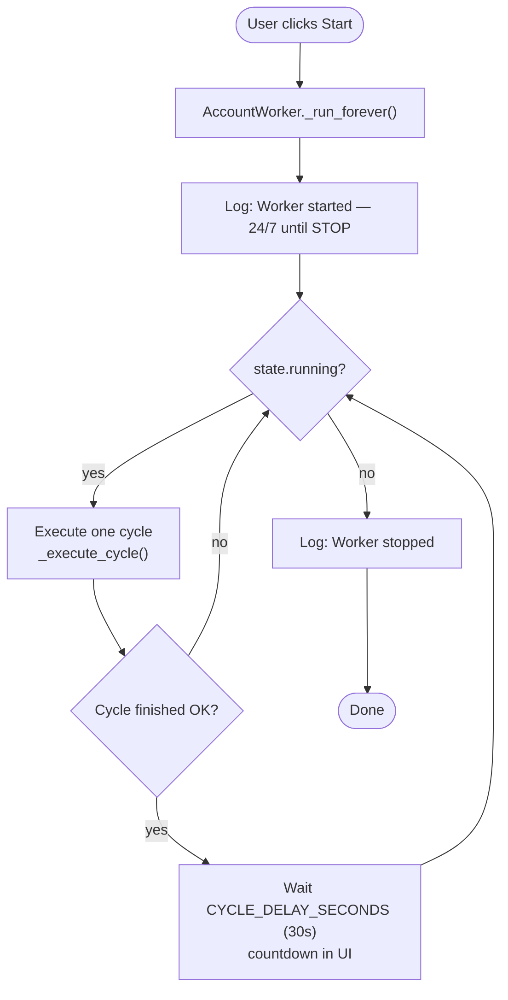
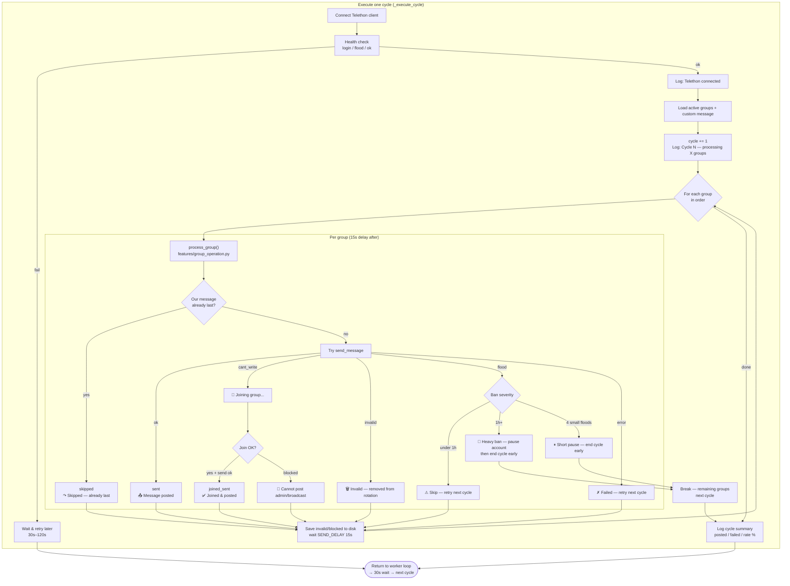

# TelegramForward — Isolated Multi-Account Architecture

## Non-negotiable rule

Every account and every feature is **completely independent**. No runtime coupling between accounts, features, or execution flows.

---

## Code structure

```
TelegramForward/
├── server.py                 # API only — no business loops
├── core/                     # Read-only shared config + per-slot clients
│   ├── config.py             # Constants, paths (immutable at runtime)
│   ├── telegram_client.py    # One Telethon client per slot
│   ├── groups_store.py       # Master groups (read-only for workers)
│   ├── message_store.py      # Message text (read-only for workers)
│   └── broadcast.py          # WebSocket fan-out (transport only)
├── features/                 # Self-sufficient operations (no cross-imports)
│   ├── check_last_message.py # Standalone scan
│   ├── send_message.py       # Standalone send (+ internal join)
│   ├── auto_join_group.py    # Standalone join
│   ├── retry_on_failure.py   # Standalone retry helper
│   ├── delay_handler.py      # Standalone delays
│   ├── logging_feature.py    # Per-account log buffer
│   ├── health_check.py       # Standalone auth/flood probe
│   └── group_operation.py    # Atomic per-group op (worker uses ONLY this)
├── workers/
│   ├── account_state.py      # Mutable state for ONE account
│   └── account_worker.py     # Independent 24/7 loop per account
├── services/
│   └── account_registry.py   # Worker registry — no shared execution
└── dashboard/                # React UI
```

---

## 1. Account-level isolation

| Resource | Isolation |
|----------|-----------|
| Worker task | `AccountWorker` per slot — own `asyncio` task |
| Telethon client | `_clients[slot]` in `telegram_client.py` |
| Session file | `session_account1.session` … `session_account4.session` (one per slot) |
| Runtime state | `AccountState` — never shared |
| Logs | `AccountLogger.logs` + `state.logs` per slot only |
| Dead groups | `data/accounts/{slot}/invalid_groups.json`, `blocked_groups.json` |
| Delays / retries | Inside each worker / feature call |
| Login OTP | `login_state[slot]` — no cross-slot fallback |

**Account A crash/stop does not affect Account B.**

### Example — one account running alone

```python
# services/account_registry.py
registry.start_account("account1")  # Only account1 loop runs
# account2 is never touched
```

```python
# workers/account_worker.py — each account's loop
async def _run_forever(self):
    while self.state.running:          # Only this slot's flag
        apply_delay = await self._execute_cycle()
        if apply_delay:
            await self._wait_countdown(CYCLE_DELAY_SECONDS, ...)
```

---

## 2. Feature-level isolation

Features **do not import each other**. Each validates inputs and handles its own errors.

| Feature | Module | Callable alone? |
|---------|--------|-----------------|
| check_last_message | `features/check_last_message.py` | YES |
| send_message | `features/send_message.py` | YES |
| auto_join_group | `features/auto_join_group.py` | YES |
| retry_on_failure | `features/retry_on_failure.py` | YES |
| delay_handler | `features/delay_handler.py` | YES |
| logging | `features/logging_feature.py` | YES |
| health_check | `features/health_check.py` | YES |

The worker does **not** chain `check_last_message → send_message`. It calls one atomic operation:

```python
# workers/account_worker.py
from features.group_operation import process_group

result = await process_group(client, group, text, my_id, self.logger)
```

`group_operation.py` is self-contained (check + send + join inline) — no imports from other feature modules.

### Example — send_message without check_last_message

```python
from features.send_message import send_message
from features.logging_feature import AccountLogger

logger = AccountLogger(slot="account1")
result = await send_message(client, "my_group", "Hello", logger)
# Works alone — joins internally if needed
```

---

## 3. State isolation

| Storage | Access |
|---------|--------|
| `data/groups_list.json` | **Read-only** for workers (`groups_readonly_snapshot`) |
| `data/custom_message.txt` | **Read-only** for workers; optional `data/accounts/{slot}/message.txt` override |
| `core/config.py` | Read-only constants |
| `data/accounts/{slot}/*` | Read/write **only by that account's worker** |
| Global mutable runtime | **None** (removed `_global_logs`) |

Workers never call `save_master_groups()` or `ensure_groups_loaded()`.

---

## 4. Execution model

- No global scheduler
- No rotation between accounts
- Each account: `while state.running: execute_cycle() → wait → repeat`
- Timing (`CYCLE_DELAY_SECONDS`, etc.) is per-worker

### 4.1 Worker loop (24/7)



### 4.2 Execute one cycle (inside `_execute_cycle`)

One cycle = one full pass over this account’s **active groups**  
(master `groups_list.json` minus that account’s invalid + blocked).



### 4.3 Cycle timing (config)

| Setting | Value | When |
|---------|-------|------|
| `SEND_DELAY` | 15–45s random | After each group (× health multiplier) |
| `CYCLE_DELAY` | 25–55s random | Between cycles |
| Batch break | 120–300s | Every 10–15 groups |
| `FLOOD_COOLDOWN_STREAK` | 4 | Small floods in a row → end cycle |
| `FLOOD_HARD_BAN_SECONDS` | 3600 | Telegram wait ≥ 1h → long pause |

### 4.4 What resets vs persists each cycle

| Resets every cycle | Persists (per account) |
|--------------------|-------------------------|
| success / failed counts | `invalid_groups.json` |
| success_list / failed_list | `blocked_groups.json` |
| flood_streak | Telethon session |
| | Master 284 groups file (read-only) |

### 4.5 Smart sending engine (`core/smart_engine.py`)

| Feature | Behavior |
|---------|----------|
| Group order | Weighted random shuffle each cycle (score + risky/recent penalties) |
| Pre-check | Skip if account sleeping, risky (3+ failures), or processed in last 30 min |
| Message check | Last 3 messages; skip if any non-service message is ours |
| Delays | Random 15–45s between groups; 25–55s between cycles; scales by health |
| Batch break | Every 10–15 groups: random 2–5 min rest |
| Scoring | `score = success - failure` per group in `data/accounts/{slot}/group_intelligence.json` |
| Account health | 0–100 score; below 70/50/30 slows delays (1.25× / 1.5× / 2×) |
| Structured logs | `account_id`, `group_id`, `action`, `reason`, `delay_used`, `timestamp` |

---

## 5. Failure isolation

- Feature exceptions → caught inside feature → safe return string
- Group failure → logged → next group
- Cycle failure → wait → retry
- Worker crash → auto-restart **that account only**

---

## 6. Logs — per account only

- Removed `registry._global_logs`
- UI shows `account_states[active_account].logs` only
- Switching account tabs switches log view
- WebSocket payload `logs` = active account logs only

---

## 7. Validation checklist

| Question | Answer |
|----------|--------|
| Can Account 1 run alone? | **YES** — `POST /account/account1/start` |
| Can Account 2 run without Account 1? | **YES** — independent worker + session |
| Can send_message run without check_last_message? | **YES** — standalone API |
| Any shared writable runtime state? | **NO** — removed global logs; per-slot state only |
| Shared groups/message files? | **Read-only** for workers; API writes at deploy/upload time |
| Feature-to-feature imports? | **NO** — except `group_operation` inlining for worker atomicity |
| Shared logs? | **NO** — per-account buffers only |

---

## API endpoints (per-account control)

| Endpoint | Scope |
|----------|-------|
| `POST /account/{slot}/start` | One account |
| `POST /account/{slot}/stop` | One account |
| `POST /start` | All logged-in (each starts own worker) |
| `POST /stop` | All accounts stopped independently |

---

## Running (auto-reload — no manual restart)

### Development (recommended)

```bash
# One command — backend reloads on .py save, frontend uses Vite HMR
python scripts/dev.py
```

Or double-click `start-dev.bat` (Windows).

- **Backend:** `uvicorn --reload` watches `core/`, `features/`, `workers/`, `services/`, `server.py`
- **Frontend:** Vite hot-reloads React on save
- **Workers:** Running workers are saved on shutdown and **auto-resumed** after reload (`data/.running_workers.json`)

### Production (PM2 with watch)

```bash
npm install -g pm2
pm2 start ecosystem.config.cjs
```

PM2 restarts the backend when Python files change (`watch: true`, 1.5s restart delay).

### Validation

| Check | Result |
|-------|--------|
| Code change triggers restart? | YES (uvicorn/PM2 watch) |
| Manual restart needed? | NO |
| Workers resume after reload? | YES (if they were running) |
| Restart loop protection? | YES (`--reload-delay 1s`, PM2 `min_uptime`) |
