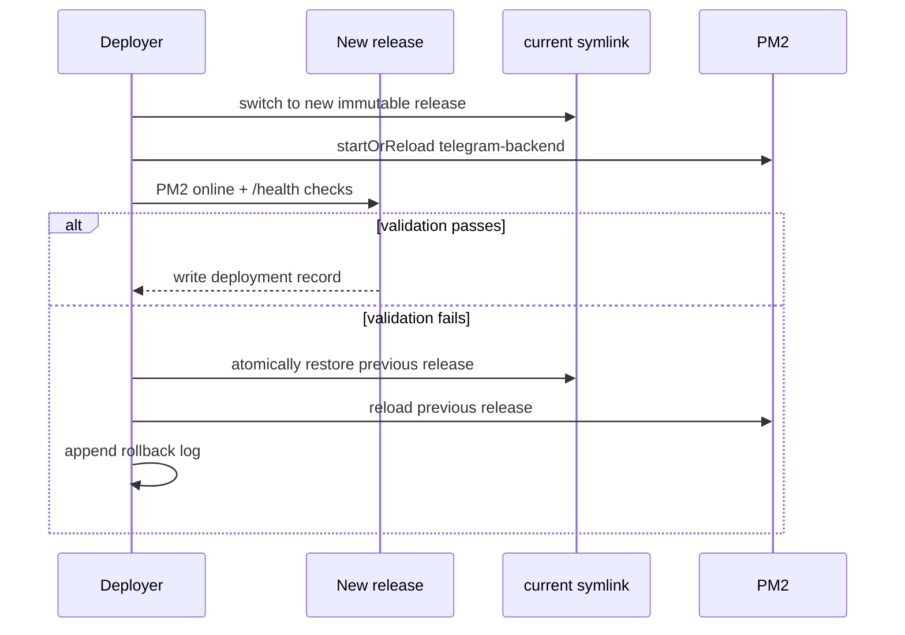

# Deterministic Production Deployments (v2)

## Status

`scripts/deploy_prod_v2.py` is a new parallel deployment path. It does not replace `scripts/deploy_prod.py`, does not deploy unless invoked with `--apply`, and has not been run against Production.

## Target architecture

```mermaid
flowchart LR
  A[Reviewed origin/main commit] --> B[Clean disposable checkout]
  B --> C[Locked dependencies + tests]
  C --> D[Fresh frontend build + manifest validation]
  D --> E[Signed-by-hash release archive]
  E --> F[/opt/telegramforward/releases/commit]
  F --> G{Validate release files}
  G -->|pass| H[Atomically switch current symlink]
  H --> I[PM2 reload + /health]
  I -->|healthy| J[Record deployment manifest]
  I -->|failure| K[Atomically restore previous release]
  K --> L[Record rollback log]
```

Production paths:

```text
/opt/telegramforward/
  current -> releases/<commit>
  releases/<commit>/                 immutable application release
  shared/.env                        secrets
  shared/data/                       runtime JSON and application state
  shared/uploads/                    uploaded files
  shared/sessions/                   Telegram .session files
  shared/logs/                       logs
  shared/cache/                      caches
  shared/config/                     runtime-only configuration overlays
  shared/pm2/telegram-backend.cjs    PM2 runtime config generated by v2
  shared/deployments/                deployment, release, and rollback records
```

Each release receives symlinks to `shared/.env`, `shared/data`, `shared/uploads`, `shared/logs`, and `shared/cache`. Existing Telegram session files in `shared/sessions` are linked into the release root because the current application resolves them relative to `BASE_DIR`. This preserves the current runtime contract without treating runtime files as release content. During an approved `--apply`, v2 writes a PM2 configuration under `shared/pm2/`; it deliberately uses `current` for `cwd`, interpreter, and `PYTHONPATH` so PM2 never relies on the old in-place project root. PostgreSQL remains an independently operated service and is never included in an archive or release directory.

## Deployment sequence

1. Fetch `origin/main`; require local `main` to be clean and byte-for-byte at the same commit.
2. Refuse unlocked dependencies. A hash-pinned `requirements.lock` and `dashboard/package-lock.json` are mandatory.
3. Clone a disposable clean checkout at the exact commit.
4. Install locked dependencies, run backend and frontend tests, compile/import checks, then make a fresh frontend build.
5. Write and validate `static/production.manifest.json`, including active bundle hashes.
6. Archive only committed source plus the generated build. Runtime directories, secrets, sessions, logs, caches, and `.git` are excluded.
7. Upload the archive to the VPS staging area, verify its SHA-256, create a new release directory, then install runtime symlinks.
8. Validate Python imports and static manifest hashes before exposing the release.
9. Atomically rename `current` to the new release symlink, reload PM2, require PM2 `online`, and call `/health`.
10. Record `release_id`, commit, payload hash, timestamp, operator, and previous release in `shared/deployments/`.

The present application binds one fixed port, so a complete backend health check happens immediately after the atomic symlink switch. If it fails, v2 restores the previous `current` symlink and reloads PM2 automatically. A future blue/green version can add a candidate port and reverse-proxy switch for zero-downtime validation.

## Rollback sequence



Manual rollback, after confirming the desired release directory:

```bash
ln -s /opt/telegramforward/releases/<previous-commit> /opt/telegramforward/.rollback-next
mv -Tf /opt/telegramforward/.rollback-next /opt/telegramforward/current
pm2 startOrReload /opt/telegramforward/current/ecosystem.production.cjs --only telegram-backend --update-env
curl -fsS http://127.0.0.1:8000/health
```

Do not delete the previous release until it has been superseded by a later verified release and the retention policy permits it.

## Recovery and disaster recovery

**Failed release:** leave `shared/` untouched, inspect `shared/deployments/rollback.log`, `pm2 logs telegram-backend`, and the failed immutable release. Re-run only after fixing the committed source or release dependency locks.

**Lost release directory:** recreate it from the exact recorded commit using v2. Runtime state remains in `shared/` and PostgreSQL, so do not restore it from the release archive.

**Lost `current` link:** choose the latest healthy release recorded in `shared/deployments/current.json`, recreate the symlink, reload PM2, and verify `/health`.

**Host loss:** restore PostgreSQL from its independent backup first; restore `/opt/telegramforward/shared/` (secrets, data, sessions, runtime config) from its encrypted backup; then run v2 from the reviewed commit. Never recover runtime state by copying a release directory.

## Current `deploy_prod.py` versus v2

| Current behavior | Risk | v2 behavior |
| --- | --- | --- |
| Builds and deploys the developer worktree | Uncommitted files can reach Production | Disposable checkout of exact `origin/main` commit |
| Auto-commits generated files | Deployment changes Git history | Never commits or pushes |
| Uploads tracked tree plus all local static files | Untracked or stale assets can deploy | Fresh build archive with manifest hash validation |
| In-place upload | Drift and obsolete files remain | Immutable versioned release directory |
| PM2 restart after overwrite | Marker can disagree with running code | Atomic `current` switch, PM2 + health verification, automatic rollback |
| Runtime files share project directory | Releases can overwrite secrets/data | Shared runtime directories outside releases |
| Weak rollback | Manual, incomplete recovery | Previous release remains immediately selectable |

## Migration prerequisites

Do not run `--apply` until all of these are complete and separately approved:

1. Commit `dashboard/package-lock.json` using the supported Node version.
2. Generate and commit `requirements.lock` with exact versions and `--hash` entries; update CI to verify it.
3. Resolve or explicitly baseline the current backend and frontend test failures so the mandatory full suites can pass.
4. On the VPS, take encrypted backups of PostgreSQL and `/opt/telegramforward` runtime state.
5. Create `/opt/telegramforward/shared/`, move `.env`, `data/`, session files, logs, caches, and runtime config into it, and validate ownership/permissions.
6. Create an initial immutable baseline release and make `current` a symlink to it. v2 intentionally refuses to replace the existing in-place directory because it would have no rollback target.
7. Start from a maintenance window and prove one release plus rollback in staging first.
8. Update PM2/system service ownership and Nginx documentation to point at `/opt/telegramforward/current` only.

## Operator use

The safe default only evaluates local Git and reproducibility gates:

```powershell
python scripts/deploy_prod_v2.py
```

An approved real release requires a clean, synchronized `main`, deterministic locks, passing full tests, and an explicit operator identity:

```powershell
$env:VPS_PASSWORD = '<set only in your shell>'
python scripts/deploy_prod_v2.py --apply --operator '<operator-name>'
```

The script never merges branches, modifies GitHub, or changes Production unless `--apply` is supplied.
